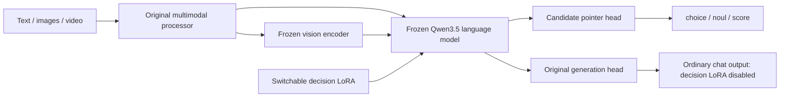

# Qev and its reference projects

**English** | [简体中文](ARCHITECTURE.zh-CN.md)

| Project | Ideas adopted by Qev | How Qev differs |
|---|---|---|
| Kev | Supervised learning, a candidate pointer head, typed answers, separate data and calibration splits | A complete Qwen3.5 multimodal foundation, an independent sequence per question, and switchable decision LoRA |
| Laya-MLX | Native MLX execution and numerical comparisons across runtimes | Does not use Laya's ModernBERT weights; Qev must retain vision modules and the generation head |
| Jev / TypeSafe | The `state + questions → typed answers` interface | Its unpublished weights and training details are unknown; Qev makes no claim of reproduction or equivalent performance |
| Qwen3.5-0.8B | Original text, image, and video understanding, plus language generation | Freezes the foundation and adds about 11.35 million trainable decision parameters |

Qwen3.5-0.8B is a dense model combining linear and full attention. Its 24 language layers repeat three GatedDeltaNet layers followed by one full-attention layer, with a hidden dimension of 1024. Jev compatibility does not imply JEPA training: Qev uses candidate cross-entropy, not a JEPA objective that predicts target latent representations.

## Decision path

Each question independently encodes the state, instructions, and complete candidate set. It reuses Qwen's existing special tokens without extending the vocabulary. Hidden vectors at each candidate-end marker and the final decision marker are projected to 256 dimensions, then scored with dot products.

Training updates only rank-16 LoRA in the language module and the small pointer head. `choice` selects the candidate with the highest probability, `noul` returns the probability of yes, and `score` returns the expected value over ordered levels. Application code constructs the JSON.

Qwen's GatedDeltaNet carries recurrent and convolutional state. Ordinary attention masks cannot isolate multiple question branches within one sequence. Qev therefore uses independent batch rows; MLX performs an uncached prefill for each question, while generation creates a fresh cache for every request. Throughput does not scale through Kev-style shared prefixes.

The public Torch API also calls the model one question at a time by default (`Agent(..., batch_size=1)`), so a question's computation shape does not change with other questions in the request. CUDA BF16 batch and padding shapes can cause numerical differences even when rows share no state. Python callers may explicitly choose a larger `batch_size` for throughput, but probabilities are then not guaranteed to match individual-question execution. Training and offline evaluation retain batch 4; reported metrics correspond to their actual precision and batching policies.

The text training budget is 1024 tokens, with at most 384 state tokens. Expanded multimodal decisions allow at most 8192 tokens and explicitly reject excess input. HTTP native generation has a local total budget of 16384 tokens. These are runtime resource limits, not changes to the foundation model's position configuration.

## Preserving multimodal capabilities

Retaining multimodal capabilities requires more than retaining a tokenizer or a Qwen label in a filename. Qev instantiates the complete `Qwen3_5ForConditionalGeneration`, including vision, the full processor, language layers, vocabulary, and generation head. Training freezes all original parameters and saves LoRA separately. Native generation runs with LoRA disabled and restores adapter state afterward.

Frozen foundation hashes and native token comparisons validate this path. The guarantee concerns the original generation path: retaining weights does not automatically guarantee the new pointer head's visual decision quality. Decision supervision in this run is textual; visual decisions are executable but have not undergone a dedicated accuracy evaluation.

## MLX

`mlx-vlm` converts the complete vision and language weights, with the pointer head and switchable LoRA saved separately. Conversion handles convolution weight layouts, Qwen's zero-centered RMSNorm, and the hybrid layer arrangement. The runtime explicitly matches the HF/FLA GatedDeltaNet L2 normalization epsilon, rather than hiding operator differences by merely loosening tolerances.

Tiny-model tests validate layouts and computation graphs. Real trained checkpoints also require comparisons of candidate probabilities, argmax, image/video generation, and isolation across requests on identical inputs. Refer to the actual reports in `docs/results` for numerical errors. FP16 / BF16 conversion cannot be described as elementwise identical for every input.
