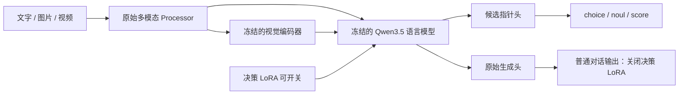

# Qev 与参考项目的关系

[English](ARCHITECTURE.md) | **简体中文**

| 项目 | Qev 采用的思路 | 本项目的区别 |
|---|---|---|
| Kev | 监督学习、候选指针头、typed answers、数据与校准分区 | 完整 Qwen3.5 多模态基座，每题独立序列，可切换决策 LoRA |
| Laya-MLX | 原生 MLX 实现与跨运行时数值对照 | 不使用 Laya 的 ModernBERT 权重；这里需要保留视觉模块和生成头 |
| Jev / TypeSafe | `state + questions → typed answers` 接口 | 不知道其未公开权重与训练细节，不声称复现或性能相等 |
| Qwen3.5-0.8B | 原始文字、图像、视频理解与语言生成 | 冻结基座，增加约 1,135 万可训练决策参数 |
| djev（DiffusionGemma） | 一次前向读出所有答案槽位 | 对照实验中扩散式读取没有提升准确率，因此保留自回归基座；见[骨干对照实验](../experiments/diffusion/README.zh-CN.md) |

Qwen3.5-0.8B 是混合线性注意力和全注意力的稠密模型。24 个语言层按每 3 个 GatedDeltaNet 加 1 个全注意力层排列，隐藏维度为 1024。Jev 兼容不等于 JEPA 训练：本项目的目标函数是候选交叉熵，没有预测目标潜在表示的 JEPA 目标。

## 决策路径

每个问题分别编码状态、指令和完整候选项，复用 Qwen 已有特殊 token，不扩词表。取各候选结束标记和最终决策标记的隐藏向量，分别投影到 256 维，再通过点积计算候选分数。

训练只更新语言模块中的 rank 16 LoRA 及小型指针头。`choice` 取最大概率候选，`noul` 返回 yes 的概率，`score` 返回有序等级的概率期望。JSON 由程序构造。

Qwen 的 GatedDeltaNet 有循环状态与卷积状态，普通 attention mask 不能隔离同一序列内的多题分支。因此这里按独立 batch row 推理，MLX 使用逐题无缓存 prefill；生成则为每次请求建立全新的缓存。吞吐不会按 Kev 的共享前缀方式扩展。纯注意力骨干可以让多道题精确共享同一个 state；[骨干对照实验](../experiments/diffusion/README.zh-CN.md)发现只有共享 state 很长（例如图片）时才划算。

公开 API 的 Torch 路径也默认逐题调用（`Agent(..., batch_size=1)`），使一个问题的计算形状不随同请求的其他问题变化。CUDA BF16 的批量与 padding 形状会带来数值差异，即使各行之间没有共享状态。Python 调用方可显式设置更大的 `batch_size` 换取吞吐，但此时不保证与逐题概率相同。训练和离线评估保持 batch 4，它们的指标对应报告中的实际精度与批量策略。

文本训练预算为 1024 token，状态最多 384。多模态决策扩展后最多 8192 token，超限明确报错；HTTP 原生生成受本地运行的 16384 token 总预算限制。这些是运行时资源限制，并非修改基座自身的位置配置。

## 多模态保留

保留多模态不能只保留 tokenizer 或文件名中的 Qwen 标签。本项目实例化完整 `Qwen3_5ForConditionalGeneration`，保留 vision、完整 processor、语言层、词表与生成头。训练时冻结所有原始参数，保存 LoRA sidecar；原生生成在禁用 LoRA 的上下文中执行，结束后恢复适配器状态。

基座冻结哈希与 native token 对照验证这条路径。该保证针对原始生成路径：新指针头的视觉决策效果不由权重保留自动保证。本轮决策监督样本为文本。之后对贪吃蛇检查点的零样本探测中，500 道 A-OKVQA 题带图答对 69.4%（无图 32.6%）；视觉决策尚未经过训练和校准。

## MLX

使用 `mlx-vlm` 完整转换视觉和语言权重，独立保存指针头和可开关 LoRA。转换需要处理卷积权重布局、Qwen 零中心 RMSNorm 和混合层布局。运行时显式匹配 HF/FLA 的 GatedDeltaNet L2 归一化 epsilon，避免仅靠放宽容差掩盖算子差异。

小型模型测试用于验证布局和计算图；真实训练 checkpoint 还需对照相同输入的候选概率、argmax、图像/视频生成与跨请求隔离。具体误差以 `docs/results` 的实际报告为准，不能把 FP16 / BF16 转换称为所有输入都逐值相同。
