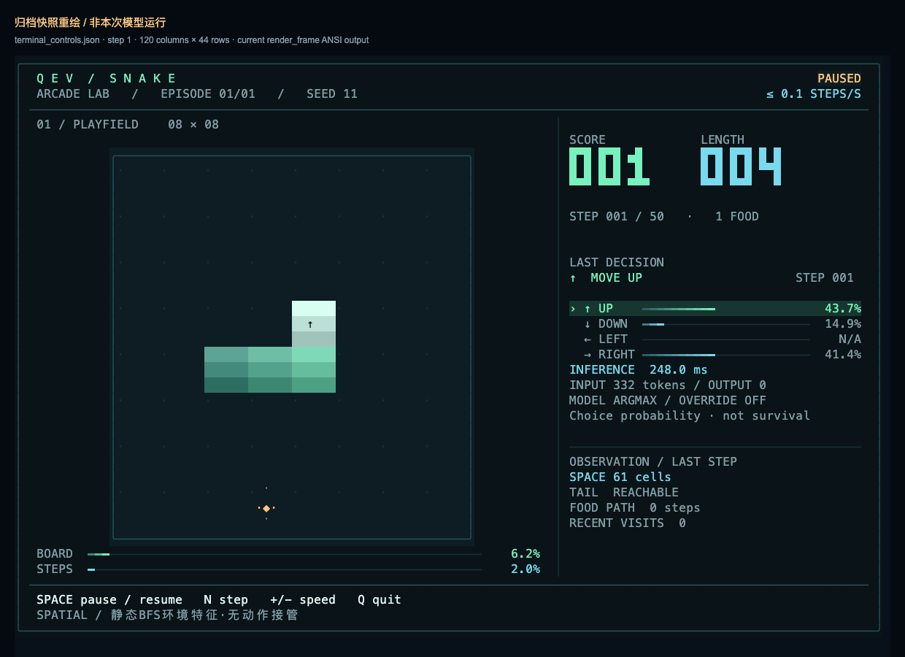
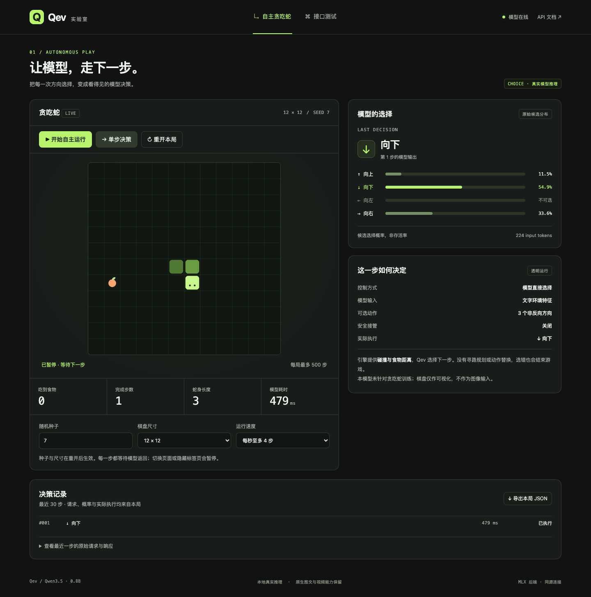
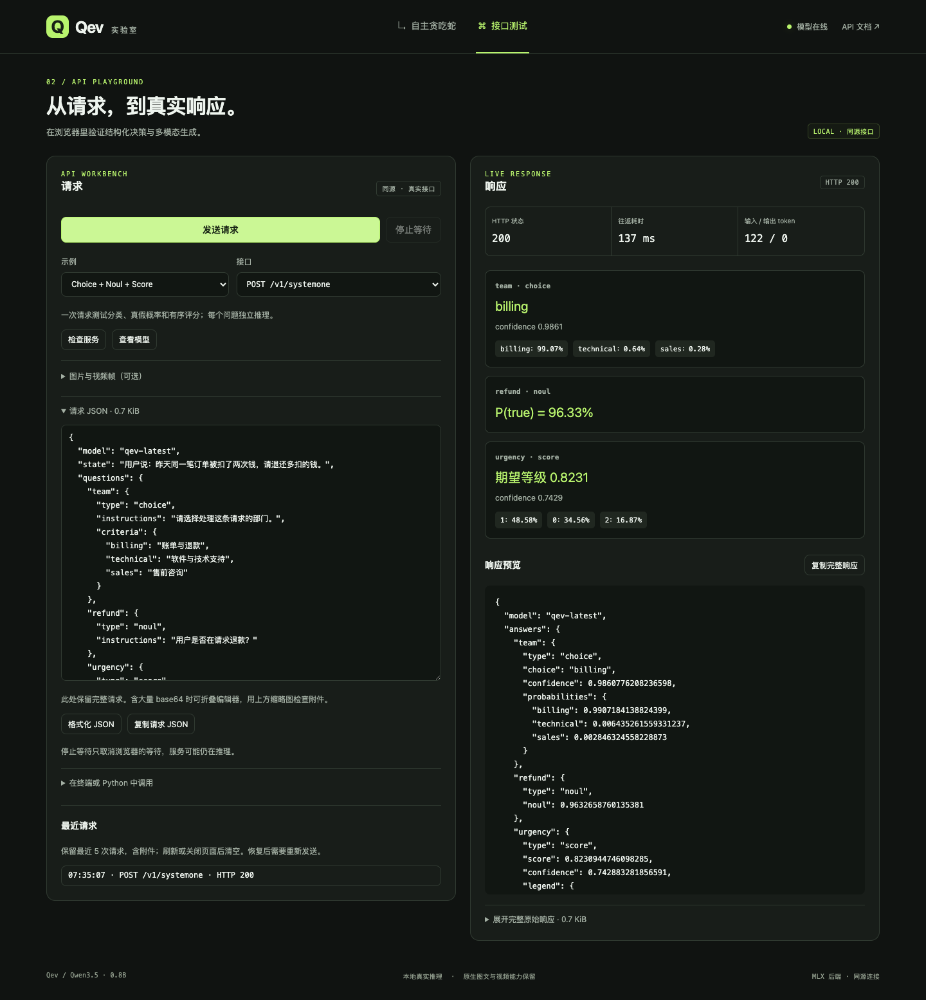

# Qev terminal Snake and API lab

**English** | [简体中文](DEMO.zh-CN.md)

The terminal is the primary Snake interface; the web app also provides game visualization and an API playground. The terminal can load a local model or connect to an existing service. Both interfaces share the game rules and `GameStore` decision path, with real inference for every direction choice. The web playground covers structured decisions and native generation; health and model-list requests only read service information.

## Run in the terminal

A fresh clone includes only code. First install the MLX dependencies and download the model (Apple Silicon, about 3.48 GB):

```bash
uv sync --python 3.12 --extra mlx --extra dev
uv run hf download twainsk/qev-0.8b-mlx --local-dir models/qev-snake-0.8b-mlx
```

Start from the repository root:

```bash
.venv/bin/qev snake
```

The terminal prefers `models/qev-snake-0.8b-mlx` when present, otherwise `models/qev-0.8b-mlx`. Snake-specific training and the new weights are complete; see the [Snake model report](SNAKE_MODEL.md) for evaluation conditions and results. An explicit `--model` always takes precedence. For example, to use the historical model:

```bash
.venv/bin/qev snake --model models/qev-0.8b-mlx --backend mlx \
  --seed 7 --size 12 --max-steps 500 --observation spatial
```

| Key | Behavior |
| --- | --- |
| Space | Pause or resume scheduling the next model decision. |
| `N` | Request and execute one step while paused. |
| `+` / `-` | Increase or decrease the step-rate limit; actual speed is still limited by inference time. |
| `Q` / Ctrl-C | Exit and release the game session created by this run; Ctrl-C returns exit code 130. |

The terminal shows the board, score, step count, real action, candidate probabilities, inference time in milliseconds, and input token count. It uses the alternate screen by default and restores the cursor and keyboard mode on exit. `--no-alt-screen` keeps the final frame; `--no-color` or the `NO_COLOR` environment variable disables color. Keys are handled between model calls, so an inference already in progress may still need to finish.

The terminal uses a dark arcade dashboard with a gradient snake body, directional head, amber food, a large score, and a separate probability panel. It adapts to window width and height, showing full panels in larger windows and a compact layout in smaller ones. The probability panel shows the most recently executed decision; the board shows the state after that action. Colors and layout do not affect inference, action selection, or report contents.



This image redraws the repository's [historical terminal record](results/snake_training/terminal_controls.json) with the current renderer. It is not a result from a new model run.
See the [80×24 compact layout](assets/snake-terminal-compact.png) for a narrow window.

`--fps 0` removes the delay between steps. `--episodes` runs 1–100 games in sequence, incrementing the seed for each game. Non-TTY output automatically enables headless mode, which can also be selected explicitly. Headless mode prints a JSON summary to standard output:

```bash
.venv/bin/qev snake --model models/qev-0.8b-mlx --observation spatial \
  --headless --fps 0 --seed 10000 --episodes 10 --size 12 --max-steps 500 \
  --report runs/snake-spatial.jsonl
.venv/bin/qev snake --model models/qev-0.8b-mlx --observation local \
  --headless --fps 0 --seed 10000 --episodes 10 --size 12 --max-steps 500 \
  --report runs/snake-local.jsonl
```

These runs hold the checkpoint, seed range, and rules fixed to compare `spatial` and `local` observations. To compare training effects, keep the observation mode fixed and change the checkpoint; report model changes separately from changes in environment assistance. Identical seeds produce identical initial boards, but later food placement also depends on the action sequence.

Reports are JSONL records flushed to disk individually. They include startup settings, model source, each game's initial state, every step's original request/response/probabilities/executed action, board snapshots, and final summaries. The destination must not already exist. Records written before an interruption remain readable. Model errors return a nonzero exit code; ordinary collisions, starvation, and reaching the step limit are valid game outcomes. `state_confirmed=false` means the state could not be read again after a failed request, so the final local snapshot may lag behind the server.

If a service is already running, reuse it from the terminal to avoid loading another model:

```bash
.venv/bin/qev snake --base-url http://127.0.0.1:8008 \
  --seed 7 --observation spatial --report runs/snake-http.jsonl
```

`--base-url` and `--model` are mutually exclusive. HTTP mode does not accept local `--backend` / `--device` selection. Requests time out after 120 seconds by default; change this with `--request-timeout`. Action POSTs are never automatically retried. After a lost response or interruption, the client only tries to read the current state once and cleans up the session it created, avoiding execution of the same step twice.

## Web service and addresses

From the repository root, use a prepared complete MLX checkpoint:

```bash
.venv/bin/python -m qev.cli serve \
  --model models/qev-snake-0.8b-mlx --backend mlx \
  --host 127.0.0.1 --port 8008
```

The model loads once at startup. Wait for the service to be ready, then visit:

- Snake: <http://127.0.0.1:8008/snake>
- API playground: <http://127.0.0.1:8008/playground>
- Interactive API documentation: <http://127.0.0.1:8008/docs>
- Health check: <http://127.0.0.1:8008/health>

The root `/` also opens the model lab. There is no separate frontend development server or CDN dependency: one Python process serves the model and interfaces. See the [README](../README.md) for environment setup and model artifacts.

On the first visit, the page selects English or Simplified Chinese from the browser language. A manual language switch is available, and the selected language is saved in the current browser for refreshes and future visits. Switching language updates interface text without translating the background, question, or candidates you edited, or changing raw request/response fields.

The MLX service uses one persistent inference thread for startup warmup, structured decisions, native generation, and Snake inference. Current MLX compiler caches are local to the calling thread. The previous arrangement warmed up on the main thread and ran HTTP inference in a worker pool, where a worker could still compile on its first call. A fixed thread lets later requests reuse the warmed compiler cache. Model calls were already serialized by a lock, so this does not reduce existing model parallelism.

The service warms up three decision paths by default: text only, background images, and candidate images. This adds initialization before readiness, with actual timing in startup logs. `--no-warmup` independently disables warmup.

MLX GPU services also enable automatic memory management by default. For the service lifetime, they request bounded model memory residency, cap unused allocator buffers at 256 MiB while preserving any lower existing limit, and clear unused allocator buffers remaining after model loading. Active model weights and precision are unchanged, and answers are not cached. Startup logs show active and cached memory before and after adjustment. Residency is subject to system limits and the configured budget; original cache and residency settings are restored on exit. `--no-wired-memory` disables this group of automatic memory settings, independently of warmup.

Initial compilation, visual processing initialization, and accessing the model again under memory pressure can all make a request slower than consecutive calls. A delay of several seconds alone does not establish a memory problem. Apple Silicon uses unified memory, and swapping or other processes' memory use can affect latency. When retesting, keep the model, startup options, and inputs fixed, record memory conditions and service timing phases, and avoid running another copy of the model in parallel.

## How Snake makes decisions

The game engine maintains the board, snake, food, and rules. Each step sends a short English observation and three non-reversing actions to `Agent.predict`, using Qev's `choice` head. State includes board size, head and food coordinates, heading, length, and steps since eating. Each candidate includes its next cell, whether it hits a wall or the body, whether it eats food, and Manhattan distance and its change. A negative distance change means moving closer to food.

The default `spatial` observation adds four **engine-computed environment features**. Assuming one legal candidate step and holding the resulting body fixed, BFS computes `reachable_space` (reachable empty cells plus the head cell), `tail_reachable` (whether the tail can be reached as the destination), and `food_path_distance` (the shortest path to food). `recent_visits` counts visits to the destination among the most recent 32 head positions. Food path distance is 0 when eating the current food and `null` when statically unreachable. These features do not inspect future food randomness or establish long-term safety as the body continues moving.

The terminal explicitly labels these as static BFS environment features with no action override. They provide static connectivity and path-search assistance, so this cannot be described as the model learning pathfinding from coordinates alone. The engine supplies neither a complete action route nor a “best action” label, and does not take over with a Hamiltonian cycle. `--observation local` retains only the historical local collision and Manhattan-distance features. Both modes exclude only the immediate reverse action prohibited by the rules; candidates that could hit walls or the body remain selectable. Entering the tail cell that moves away on this step is legal.

Qev returns raw candidate probabilities, and the service directly executes the direction with the highest probability. The model's preferred action, executed action, and original request/response are all recorded. **There is no safety override or action substitution.** A model error, invalid probabilities, or a truncated observation ends the game with `model_error`; no fallback action is invented.

The historical v0.2 `qev-0.8b` / `qev-0.8b-mlx` models were not trained on Snake. Current Snake-specific continued training is complete: an explicit deterministic heuristic teacher reads the same visible features to generate supervised action labels, mixed with replay of the original tasks. This is imitation training; the teacher does not select actions at runtime. See the [Snake model report](SNAKE_MODEL.md) for models and game metrics under matched conditions.

The terminal/web board is only a visualization and is not fed to the model as an image. It does not show that the model learned long-term planning from a raw board. Probability bars show candidate selection probabilities, not survival probabilities. The historical model's temperature comes from general text tasks; consult the relevant training report for a new checkpoint's calibration scope.

Defaults are a 12×12 board, an initial length of 3, and at most 500 steps per game. A wall collision, body collision, full board, step limit, or `2 × size²` consecutive steps without food ends the game. The score is the number of food items eaten; reaching the step limit is not completing the board.

## Web controls and game API

| Control | Behavior |
| --- | --- |
| Start / Pause | Request model steps continuously, or stop scheduling the next step. A request already sent may still complete. |
| Single step | Request and execute one step while paused. |
| Restart game | Delete the old session and create a new one with the current seed and size. |
| Random seed | Takes effect after restart. The same seed and size reproduce the initial board; later food also depends on the executed actions. |
| Board size | The web UI offers 8×8, 12×12, and 16×16; changes take effect after restart. |
| Run speed | Controls only the pace between steps. Each step waits for real inference; calls are not pregenerated or skipped. |
| Export game JSON | Download the complete server history, including actual requests, responses, probabilities, executed actions, and timing. |

Outside input controls, Space starts/pauses and the right arrow steps once while paused. Switching to the playground or hiding the browser tab pauses Snake. The page shows the latest 30 steps; exports retain all records for the game. Export the old game before restarting if you need to keep it.

After a request timeout, the page reads the current server state instead of resending the same step. The server rejects stale retries through `expected_step` with HTTP 409, preventing duplicate execution. By default there can be at most 8 sessions, which expire after 30 idle minutes. Closing the page attempts to release its game, and restarting the service clears sessions.

“Model time” is the server-side wall-clock duration of `Agent.predict`, including encoding and result processing. Selected speed is an upper bound; actual steps per second are still limited by model computation. Structured decisions return `output_tokens=0` because they do not generate autoregressive text, but they still run a model forward pass.

The game API uses the following protocol, with the `/api/snake` prefix:

| Request | Input and result |
| --- | --- |
| `POST /games` | JSON: `{"seed":7,"size":12,"max_steps":500,"observation":"spatial"}`. `observation` is `spatial` (default) or `local`. Returns 201 and initial state with an `id`. |
| `GET /games/{id}` | Returns current state and `last_decision`. |
| `POST /games/{id}/step` | JSON: `{"expected_step":0}`, matching the current step. Returns the resulting state and original decision record. For a finished game, using the current step only returns its unchanged state. |
| `GET /games/{id}?history=true` | Returns current state and complete `history` for export. |
| `DELETE /games/{id}` | Deletes the session and returns 204. Restarting deletes and then creates a session. |

The API accepts signed 32-bit seeds, board sizes from 6 to 20, and per-game step limits from 1 to 2000. Unknown or expired sessions return 404; another operation in progress for the same game or a stale `expected_step` returns 409; full session capacity returns 429; invalid parameters return 422.

## API playground

Open <http://127.0.0.1:8008/playground>, select a scenario, edit the background, question, and options, then send a real model request. All three scenarios use `choice`:

| Scenario | Input | Image location in the request |
| --- | --- | --- |
| Text-only choice | Text background, question, and named candidates. | No images. |
| Background image | Inspect a background image and choose from text candidates. | A `state` content array, optionally wrapped as `state.content`. |
| Images in every option | Text background and question, with an image and description for each candidate. | `questions.<question>.criteria.<option>.content`. |

Image scenarios include built-in geometric images that are ready to send. You can also upload, paste, replace, or remove PNG, JPEG, or WebP images in the background or corresponding option. The background area and each option have separate paste targets: select the target area, then press Ctrl/Cmd+V. A clipboard button is also available when the browser supports clipboard reading. Pasted images use the same media budgets as uploads and are submitted only when you send the request. Candidate images participate in visual encoding inside their corresponding candidates. All three scenarios call `POST /v1/systemone`, returning `answers.<question>.choice`, `probabilities`, and `confidence`, without generating answer text: `usage.output_tokens=0`.

“Advanced JSON” stays synchronized with the form and lets you edit, format, or copy the complete request. After sending, the page shows the real HTTP status, round-trip time, token usage, and response. The request preview also provides copyable curl and Python `httpx` examples. “More examples” retains `choice + noul + score`, native text/image/video generation, service status, and model listing. See the [image decision examples](API.md#image-decisions) for the complete background/candidate image protocol.

- `/v1/systemone` accepts `state` and `questions`, returning candidate probabilities and typed results.
- `/v1/chat/completions` uses native Qwen text, image, and video generation with decision LoRA disabled.
- `/health` and `/v1/models` are read-only GET endpoints.

Media upload in “More examples” still supports multiple images and sampled video frames. Video consists of **multiple sampled-frame images**, sorted naturally by filename. All frames must have identical dimensions. The default frame rate is 2, with `0 < fps ≤ 60`. This does not upload MP4 files or ask the server to fetch online video. This upload area appends images/frames to the last user message of a native request, or to `state` in structured decisions. Candidate images are uploaded within their corresponding options. Preview and remove attachments before sending; only clicking Send submits them to the service.

Each image allows at most 2 MiB, with at most 8 MiB total per request. Background images/video frames and candidate images across all questions share a limit of 8 images. Each image allows at most 4 million pixels, with at most 8 million pixels total. Attachments become inline data URLs; the service does not open local paths or download remote URLs from requests. Long base64 strings are collapsed in the preview, but copying and sending use the complete data.

The page keeps its most recent 5 requests in browser memory for restoring to the editor, without resending them automatically. Separately, `qev serve` saves requests to the two model POST endpoints and their completed responses under `runs/request-logs` by default, including full inline image data and extracted media files. Use `--request-log-dir PATH` to choose another directory or `--no-request-log` to disable server logging. The response headers `X-Qev-Request-Id` and `X-Qev-Log-Status` identify a record and report whether writing succeeded; files are available locally, not through the webpage. See [local request logs](API.md#local-request-logs) for the layout and exception behavior.

“Stop waiting” cancels the browser's wait; the server may still finish inference already started and write its log. The complete raw response can also be expanded or copied.

Candidate images are an inference input protocol. Existing training data and pointer-head supervision remain textual, and decision accuracy for background/candidate images has not been validated. Media questions use `T=1` without the text calibration temperature. Native multimodal generation retains the complete Qwen foundation; see the [model card](MODEL_CARD.md) and [API protocol](API.md).

Frontend request construction, language selection, and clipboard routing use Node.js's built-in test runner without installing frontend dependencies: `node --test tests/test_*.mjs`. Once the service is running, recheck the three choice scenarios, native generation, and error handling:

```bash
uv run python scripts/validate_service.py \
  --checkpoint models/qev-snake-0.8b-mlx --backend mlx \
  --base-url http://127.0.0.1:8008 --output runs/choice-validation.json
```

The page distinguishes HTTP round-trip time from server decision time. In the response, `qev.timings_ms` reports `decode`, `queue`, `encode`, `inference`, and `total`: request validation/media decoding; waiting for the dedicated inference thread and model lock; input encoding; model forward/probability processing; and total server decision time. `total` includes thread queueing. Initial compilation and other compute initialization appear in `inference`. HTTP time also includes endpoint handling, serialization, local log writing when enabled, and transport, so the difference is not pure network latency.

Retest three fixed small examples against an existing service without loading another model:

```bash
uv run python scripts/benchmark_http.py --base-url http://127.0.0.1:8008 \
  --repeats 5 --label 'qev-snake-0.8b-mlx, default startup options' \
  --output runs/http-latency.json
```

The script separately saves each scenario's first observation and at least 3 subsequent rounds. It reports original responses, HTTP/service timing phases, and the median and P95 of subsequent samples. P95 uses the nearest-rank method and equals the maximum with fewer than 20 samples. The service may already have warmed up or handled requests, so the first observation cannot automatically be called a cold start. To compare with warmup disabled, restart the service and use a new report file. `--interval 10` waits 10 seconds between rounds. Consecutive latency for fixed examples describes only those conditions; it is neither a general performance claim nor evidence of cached answers. The returned model alias does not identify the weight files; record the model path, startup options, and memory conditions in `--label`.

On an Apple M2 Pro with 16 GiB memory and FP32 `qev-snake-0.8b-mlx`, with default memory management, the persistent inference thread, and warmup enabled, **the three actual page presets** produced the following HTTP times in milliseconds, measured in rounds. These inputs differ from the benchmark script's built-in examples. Input summaries and raw timing are saved in the [measurement summary](results/choice_latency.json).

| Scenario | First observation | Median of next 5 calls | P95 / maximum of next 5 calls |
| --- | ---: | ---: | ---: |
| Text-only choice | 1467.41 | 38.78 | 39.99 |
| Background image | 113.44 | 79.03 | 80.15 |
| An image in each of three options | 176.28 | 168.72 | 169.38 |

Choices matched the existing baseline, with candidate probability differences below `1e-6`. For consecutive requests, the difference between HTTP and total service time was typically 1–3 ms. **First requests after an idle period still took about 1.5–2.6 seconds.** One text request recorded `inference=2593.26 ms` and `queue=0.16 ms`, followed by an immediate repeat at 58 ms. The slow requests are not fully explained. These observations are not controlled causal comparisons of individual optimizations and do not guarantee that requests after idle periods will achieve the consecutive-call latency in the table.

## Real HTTP validation

Start the service as above, then run this from another terminal:

```bash
.venv/bin/python scripts/validate_demo.py \
  --base-url http://127.0.0.1:8008 --expected-backend mlx \
  --seeds 7,11,42 --size 12 --max-steps 32 \
  --output runs/demo-validation-current.json
```

The script connects only to the existing service; it does not start another server or load another model. It checks the home page and static modules, game creation and reading, step execution, complete history, restart with the same seed, session isolation, HTTP 409 for duplicate steps, and HTTP 404 after deletion. Validation sessions are cleaned up afterward.

Real games for three seeds run step by step until termination. Every step checks that pre-action environment features match the request, probabilities are finite and normalized, `argmax == choice == proposed == executed`, no state truncation or override occurred, body/step/score updates are correct, and exported history matches. Reports retain complete original model responses, each game's score/steps/termination reason, and inference/HTTP latency distributions.

The saved results below are the real MLX HTTP validation of the **historical v0.2 model with the older local observations**, run on 2026-09-21 (Singapore time). **All 7 checks passed.** They do not describe current `spatial` observations or the new Snake-specific model. Three seeds on a 12×12 board executed 96 steps in total:

| Seed | Executed steps | Score (food eaten) | Termination reason |
| --- | --- | --- | --- |
| 7 | 32 | 0 | `max_steps`: test step limit reached |
| 11 | 32 | 2 | `max_steps`: test step limit reached |
| 42 | 32 | 0 | `max_steps`: test step limit reached |

None of the three games filled the board. Across 96 game decisions, median inference time was 147.81 ms and P95 was 162.41 ms; these are records from that actual run. Complete evidence is retained in the report below. Passing API validation does not establish reliable food collection or long-term route planning.

**Valid wall collisions, body collisions, and games that reach the step limit are all recordable outcomes and do not determine whether API validation passes.** Model errors, invalid probabilities, truncation, action substitution, or inconsistent audit records cause validation to fail with a nonzero exit code. The report is saved in [demo_validation.json](results/demo_validation.json). It validates the execution and decision path, not a Snake policy quality leaderboard.

## Historical browser validation and screenshots

The following is an archive of the v0.2 web interface, not validation of the terminal or newer spatial features. Chrome was connected to the real MLX service to verify start, pause, single-step, restart after seed/size changes, pause on page navigation, and JSON download. Downloads matched the complete server history. The playground sent real Choice/Noul/Score, text, image, and four-frame video requests, and checked history restoration, copying, invalid JSON, HTTP 404, and the stop-waiting message. Native generation responses reported the decision adapter as disabled.

Neither desktop 1440×1000 nor mobile 390×844 had horizontal overflow. The final automated accessibility check found no WCAG 2 A/AA violations; some contrast checks on decorative symbols and gradient backgrounds remained indeterminate, so this is not comprehensive accessibility certification. Detailed responses, viewport records, check results, and final static asset hashes are saved in [demo_browser_validation.json](results/demo_browser_validation.json). Resource hashes in the preceding HTTP game report predate the final interface adjustments; use the browser report's final resource records.

The image test correctly described a red square. The video-frame request succeeded, but its answer hallucinated a second moving white circle. This confirms only that the multimodal call path worked, not that visual accuracy passed validation.




